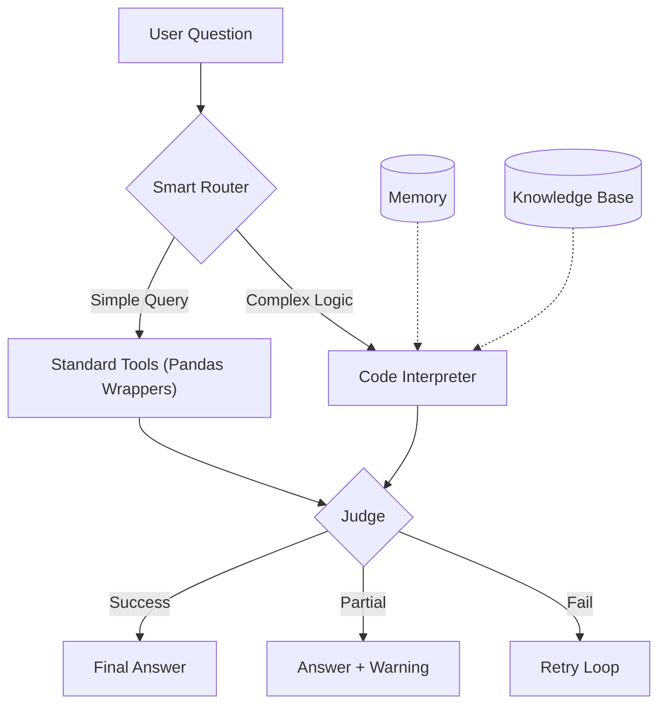

# AutoPM - Autonomous Process Mining Agent

AutoPM — это **агентная система** для автоматического анализа бизнес-процессов. В отличие от жестких скриптов, AutoPM ведет диалог, запоминает контекст, пишет и исполняет Python-код для сложных запросов и самостоятельно проверяет качество своих ответов.

## 🚀 Ключевые Возможности (Feature Set)

### 🧠 Когнитивное Ядро (Agentic Core)
*   **Proactive Router**: Агент сам решает, какой инструмент использовать. Для простых вопросов (частота операций) он берет готовые функции, а для сложных (медиана, фильтрация по условию) — **сразу пишет Python-код**.
*   **Long-Term Memory**: Агент "помнит" весь контекст диалога. Вы можете спросить *"А почему здесь цифра такая?"*, и он поймет, что речь идет о таблице из прошлого ответа.
*   **Robust Verification**: Встроенный "Судья" проверяет ответы. Если ответ верен по сути, но не идеален по форме, агент покажет его с пометкой "Partial Success", вместо бесконечных переделок.

### 🐍 Code Interpreter & Sandbox
*   **Dynamic Code Generation**: Для ответов на вопросы, которых нет в стандартных меню, агент пишет Pandas-код на лету.
*   **Safe Executor**: Исполнение кода изолировано (запрещен доступ к файловой системе вне проекта, сети и системным вызовам).
*   **Smart Fallback**: Если стандартный инструмент не справился, агент автоматически переключается на написание кода.

### 📊 Классический Пайплайн (при старте)
Перед началом диалога система проводит полный цикл анализа:
1.  **Профилирование** (Data Profiling).
2.  **Очистка** (Data Cleaning + Auto-Outlier Removal).
3.  **Process Discovery** (Построение карты процесса через PM4Py).
4.  **Анализ Аномалий** (Поиск узких мест и редких путей).
5.  **Генерация Отчета** (Markdown + Графики).

---

## 🚦 Быстрый старт

### 1. Установка
```bash
git clone <repository_url>
cd AutoPM
pip install -r requirements.txt
```

### 2. Конфигурация
Создайте `config.json` в корне проекта:
```json
{
    "api_key_LANGCHAIN_mistral": "ВАШ_API_КЛЮЧ",
    "model_LANGCHAIN_mistral": "mistral-small-latest",
    "llm_backend": 2
}
```

### 3. Запуск
```bash
python pm_agent/main.py --file "data/logs.csv"
```
После завершения начального анализа, **система перейдет в режим чата**. Вы можете спрашивать:
*   *"Покажи 25-й по популярности путь"*
*   *"Какая средняя длительность кейсов, начинающихся с 'Start'?"*
*   *"Найди аномалии в отделе продаж"*

---

## 🛠 Архитектура



### Компоненты
*   `main.py`: Оркестратор и цикл чата (ReAct Loop).
*   `llm.py`: Мозг агента (LLM Client, Prompts, Verification).
*   `chat_tools.py`: Библиотека из 15+ pandas-функций.
*   `safe_executor.py`: Песочница для исполнения сгенерированного кода.
*   `agents/`: Специализированные агенты начального пайплайна (Discovery, Analysis и др.).

## 👨‍💻 Контрибьюторам
При разработке новых фич учитывайте:
*   **Context Awareness**: Любой новый инструмент должен уметь принимать `context` (память).
*   **Safety**: Пандас-код должен исполняться только через `SafeExecutor`.
