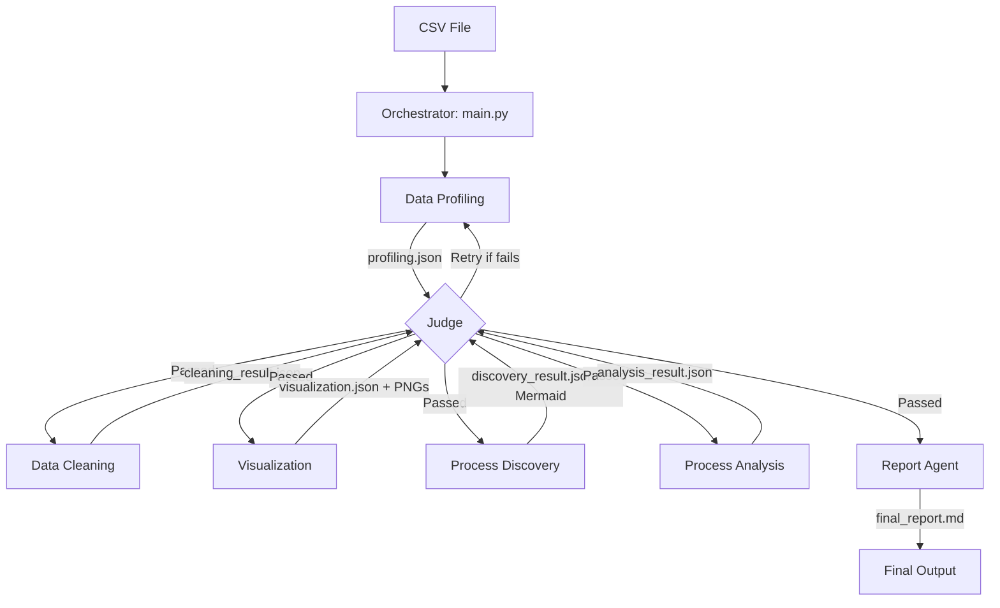

# Multi-Agent Process Mining System

Система автоматического анализа бизнес-процессов на основе Multi-Agent архитектуры. Система использует **строгое разделение вычислений (Python)** и **интерпретации (LLM)**, что гарантирует достоверность цифр и обоснованность выводов.

## 🚀 Быстрый старт

### 1. Установка
Клонируйте репозиторий и установите зависимости:
```bash
git clone <repository_url>
cd AutoPM
pip install -r requirements.txt
```

### 2. Настройка (Конфигурация)
Система требует API-ключ для взаимодействия с Mistral AI.
1. В корне проекта создайте файл `config.json` (или отредактируйте существующий).
2. Вставьте ваш API-ключ в поле `api_key_LANGCHAIN_mistral`:
```json
{
    "api_key_LANGCHAIN_mistral": "ВАШ_API_КЛЮЧ_ЗДЕСЬ",
    "model_LANGCHAIN_mistral": "mistral-small-latest",
    "llm_backend": 2
}
```

### 3. Запуск
Для запуска анализа передайте путь к CSV-файлу:
```bash
python pm_agent/main.py --file "your_data.csv"
```
Результаты (отчет и графики) будут сохранены в папку `reports/`.

---

## 🛠 Архитектура системы

Система построена на принципе **строгого разделения вычислений (Python) и интерпретации (LLM)**. Это гарантирует, что все цифры в отчетах реальны, а выводы обоснованы.



Вся работа координируется оркестратором `main.py`, который проводит данные через цепочку специализированных агентов. Каждый шаг проверяется **Судьей (Judge)**.

### Цепочка агентов:
1.  **Data Profiling**: Вычисляет статистику (пропуски, уникальные значения, топ-10) и оценивает готовность данных к Process Mining.
2.  **Data Cleaning**: LLM составляет план очистки, а Python исполняет его (удаление дубликатов, заполнение пропусков).
3.  **Visualization**: Генерирует 4 обязательных графика (распределение операций, времени, длительности кейсов и интервалов).
4.  **Process Discovery**: Использует `pm4py` для построения модели процесса и генерации интерактивной схемы **Mermaid**.
5.  **Process Analysis**: Вычисляет KPI процесса, находит узкие места и аномалии, используя адаптивные единицы времени.
6.  **Report Agent**: Собирает все артефакты в финальный Markdown-отчет.

---

## 👨‍💻 Для разработчиков

### Основные принципы:
- **Изоляция данных**: Каждый агент работает с копией DataFrame, что предотвращает побочные эффекты.
- **Робастность**: Реализована логика повторных попыток (retries) для API и гибкий поиск имен столбцов (Case ID, Activity, Timestamp).
- **Валидация**: Судья (Judge) проверяет каждый шаг на соответствие чек-листу, наличие файлов и адекватность выводов.

### Структура проекта:
- `pm_agent/main.py` — точка входа и оркестрация.
- `pm_agent/agents/` — реализация логики каждого агента.
- `pm_agent/llm.py` — клиент для работы с LLM и промпты Судьи.
- `pm_agent/config.py` — загрузка настроек из `config.json`.
