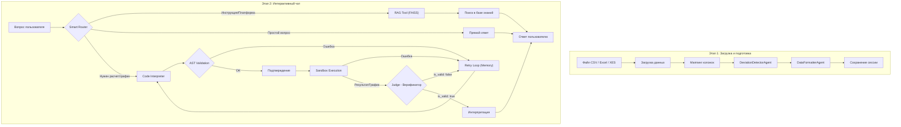

# AutoPM — Интеллектуальный агент для Process Mining

AutoPM — это мультиагентная система для загрузки, анализа и интерактивного исследования данных бизнес-процессов (Event Logs). Агент умеет автоматически находить отклонения, отвечать на вопросы по документации платформы (RAG), а также генерировать и безопасно выполнять Python-код для глубокой аналитики и визуализации.

## 🛠 Архитектура


```mermaid
graph TD
    subgraph "Этап 1: Загрузка и подготовка"
        File["Файл CSV / Excel / XES"] --> Load["Загрузка данных"]
        Load --> ColMap["Маппинг колонок"]
        ColMap --> DevDet["DeviationDetectorAgent"]
        DevDet --> Fmt["DataFormatterAgent"]
        Fmt --> Save["Сохранение сессии"]
    end

    subgraph "Этап 2: Интерактивный чат"
        User["Вопрос пользователя"] --> Router{"Smart Router"}
        Router -->|"Инструкция/Платформа"| RAG["RAG Tool (FAISS)"]
        Router -->|"Простой вопрос"| DirectAnswer["Прямой ответ"]
        Router -->|"Нужен расчет/график"| CodeGen["Code Interpreter"]

        RAG --> RAGResult["Поиск в базе знаний"]
        RAGResult --> Answer

        CodeGen --> ASTCheck{"AST Validation"}
        ASTCheck -->|"Ошибка"| Retry
        ASTCheck -->|"OK"| Confirm["Подтверждение"]
        Confirm --> Sandbox["Sandbox Execution"]

        Sandbox -->|"Ошибка"| Retry["Retry Loop (Memory)"]
        Sandbox -->|"Результат/График"| Judge{"Judge - Верификатор"}

        Judge -->|"is_valid: false"| Retry
        Judge -->|"is_valid: true"| Interpret["Интерпретация"]
        Interpret --> Answer["Ответ пользователю"]
        DirectAnswer --> Answer
        Retry --> CodeGen
    end
```

### Как это работает

1.  **Загрузка и Анализ** — загружает данные, находит 18 типов отклонений и автоматически приводит типы колонок.
2.  **Smart Router** — анализирует вопрос и выбирает инструмент: прямое общение, поиск в документации (RAG) или написание кода.
3.  **RAG (Local Knowledge Base)** — при вопросах о платформе ищет инструкции в локальных `.md` файлах через FAISS и модель `multilingual-e5-large`.
4.  **Code Interpreter** — пишет pandas-код для расчетов или `matplotlib` для графиков. Выполняется в защищенной песочнице.
5.  **Judge & Memory** — Судья проверяет адекватность ответа в контексте диалога, а глобальная память ошибок помогает ассистенту не повторять прошлые промахи.

## 🚀 Возможности

*   **RAG (Knowledge Base)**: Поиск по руководствам платформы (локально, через FAISS).
*   **Визуализация**: Построение графиков прямо в чате (Matplotlib).
*   **Data Profiling**: Ассистент видит `head()`, `describe()` и частые значения для точного написания кода.
*   **Продвинутый Судья**: Проверка логики ответа с учетом истории чата.
*   **Память ошибок**: Сохранение и учет всех Traceback сессии для самоисправления.
*   **Deviation Detection**: Авто-поиск 18 типов процессных отклонений (циклы, узкие места и т.д.).
*   **Безопасность**: Выполнение кода в Sandbox с AST-валидацией.

## 🚦 Быстрый старт

### 1. Установка
```bash
git clone <repository_url>
cd AutoPM
pip install -r requirements.txt
```

### 2. Подготовка RAG (Оффлайн-режим)
Если вы запускаете систему без интернета, убедитесь, что модель скачана:
```bash
python download_model.py # Один раз для загрузки в models/
```

### 3. Конфигурация (`config.yaml`)
```yaml
provider: "mistral" # "mistral" или "local"
mistral:
  api_key: "YOUR_KEY"
rag:
  docs_dir: "PM_Platform_docs"
  embedding_model_path: "models/multilingual-e5-large"
```

### 4. Заполнение базы знаний
Поместите ваши инструкции (`.md`) в папку `PM_Platform_docs/`.

### 5. Запуск
```bash
python pm_agent/main.py --file "log.csv"
```

---

## 🔒 Безопасность: Safe Executor

| Слой | Описание |
|---|---|
| **AST Validation** | Блокировка потенциально опасного синтаксиса |
| **Sandbox** | Ограниченные `builtins` (нет `open`, `exec`, `eval`, `import`) |
| **White-list** | Доступны только `df`, `pd`, `np`, `plt` |
| **Timeout** | Защита от бесконечных циклов |

---

## 📁 Структура проекта

```
AutoPM/
├── pm_agent/
│   ├── main.py              # Точка входа и чат-петля
│   ├── llm.py               # Оркестрация: Router, CodeGen, Judge
│   ├── rag_manager.py       # RAG: Поиск через FAISS и E5
│   ├── safe_executor.py     # Песочница для Python-кода
│   └── agents/              # Специализированные агенты (PM-логика)
├── PM_Platform_docs/        # Ваша документация для RAG (.md файлов)
├── models/                  # Локальные модели (e5-large)
├── config.yaml              # Настройки ключей и путей
└── reports/                 # История сессий, кеш данных и графики
```

## 🧰 Стек технологий

*   **LLM**: Mistral API / Local Llama (via OpenAI compatible API)
*   **Embeddings**: multilingual-e5-large (Local)
*   **Vector DB**: FAISS
*   **Analysis**: PM4Py, Pandas, SciPy, NumPy
*   **Viz**: Matplotlib
